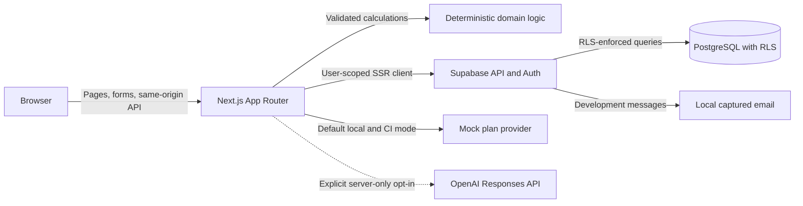

# Cutting Plan

[](https://github.com/thereallinkai/Cutting-1.0/codespaces/new?quickstart=1)

Cutting Plan is a calm, safety-aware meal-planning and habit-tracking application. It combines meal guidance, daily meal check-ins, weight-trend tracking, and a versioned plan workflow without presenting estimates as medical facts or guaranteeing a body-weight outcome.

The repository is a single full-stack TypeScript application built with Next.js App Router, React, Tailwind CSS, Supabase PostgreSQL and Auth, a deterministic mock AI provider, an optional server-only OpenAI provider, Vitest, React Testing Library, and Playwright.

> **Wellness and safety:** Cutting Plan provides general wellness information and is not medical advice. Individual needs can vary. Consult a qualified healthcare professional or registered dietitian when appropriate.

## Current feature set

The repository is structured to provide:

- Public landing, login, registration, password-recovery, Terms, and Privacy experiences.
- Authenticated Today, My Plan, Calendar, Progress, and Settings navigation on desktop and mobile.
- Resumable onboarding for profile, food preferences, goals, lifestyle, safety context, and review.
- A searchable food catalog with meal assignment, composition guidance, and nutrition-verification states.
- Versioned seven-day plans with an accepted-plan boundary.
- Daily meal check-ins, local-date weight entries, progress summaries, and rolling trends.
- Deterministic unit, date, progress, completion, nutrition, filtering, and safety calculations.
- Local Supabase Auth, PostgreSQL, Row Level Security, migrations, deterministic seed data, Studio, and captured email.
- Mock-backed plan generation for credential-free development and CI.
- A server-only, explicit-opt-in OpenAI path that validates structured output before persistence.
- Unit, component, database/RLS, end-to-end, responsive, and accessibility test surfaces.

The local and CI paths do not require a hosted Supabase project, SMTP provider, OpenAI key, Vercel account, or production secret. See [Current limitations](#current-limitations) for the external configuration that remains intentionally separate.

## Architecture



The browser uses same-origin Next.js pages, Route Handlers, and Server Actions. Protected operations resolve the authenticated user on the server and use a user-scoped Supabase client so Row Level Security remains active. Server-only provider code loads trusted profile data from PostgreSQL; the browser never sends an arbitrary trusted profile snapshot to OpenAI.

Deterministic code—not a language model—owns unit conversion, timeline math, progress, completion, rolling averages, nutrition totals, food filtering, data-sufficiency states, and safety flags. AI output is a suggestion that must reference allowed food IDs, pass validation, and be recalculated before a complete plan version can be saved.

## Development environment strategy

| Path | Host requirements | Intended use |
| --- | --- | --- |
| GitHub Codespaces | A browser and GitHub access | Primary zero-local-install development path |
| VS Code Dev Container | Git, VS Code, Docker Desktop or a compatible Docker runtime, and the Dev Containers extension | Reproducible local fallback |
| Bare host | Not supported | Do not install Node, PostgreSQL, Supabase CLI, or Playwright directly for this project |
| Production | Authorized cloud accounts and securely configured runtime values | Separate deployment process; never the local Supabase stack |

The Dev Container pins Node.js `22.23.1` and npm `10.9.8`, includes Git, GitHub CLI, Docker-in-Docker, the PostgreSQL client, browser system libraries, and recommended VS Code extensions. Supabase CLI and Playwright remain project-local lockfile dependencies.

The recommended Codespaces machine has at least 4 CPU cores, 8 GB memory, and 32 GB storage because local Supabase runs several containers.

## Zero-local-install GitHub Codespaces

1. Select the badge above or use **Code → Codespaces → Create codespace**. A repository branch, feature branch, or pull-request branch can be opened in its own Codespace.
2. Wait for the Dev Container `postCreateCommand`. It runs `npm run bootstrap`, which installs the exact lockfile and prepares the credential-free local stack.
3. Run **Terminal → Run Task → Start Cutting Plan**. The same action is available from the Command Palette as **Tasks: Run Task**.
4. Open the privately forwarded **Cutting Plan** port when VS Code prompts.

The application, Supabase API, PostgreSQL, Supabase Studio, and captured-email ports are private by default. Bootstrap derives the application origin and exact Supabase Auth callback from Codespaces runtime variables without embedding a GitHub domain literal. Use the Codespaces **Ports** panel to open Studio or captured email instead of copying a forwarded-domain pattern into configuration.

Codespaces can be configured for prebuilds after the workflow is stable. Prebuilds must not start secret-dependent work or embed a key in the container image.

## Local VS Code Dev Container

The local desktop prerequisites are limited to:

- Git.
- VS Code.
- Docker Desktop or another compatible Docker runtime.
- The VS Code Dev Containers extension.

Then:

1. Clone the repository.
2. Open the repository folder in VS Code.
3. Select **Dev Containers: Reopen in Container**.
4. Wait for bootstrap to complete.
5. Run the **Start Cutting Plan** task if it did not already start.
6. Open the forwarded application URL.

No host installation of Node.js, npm packages, PostgreSQL, Supabase CLI, or Playwright is used by this path.

## Bootstrap and start behavior

`npm run bootstrap`:

1. Confirms that it is running in the Linux Codespace, Dev Container, or CI environment.
2. Verifies Node, npm, Docker, `psql`, and `curl`.
3. runs `npm ci`;
4. starts or reuses local Supabase and waits on an actual health endpoint;
5. applies pending version-controlled migrations without resetting data;
6. applies the deterministic, idempotent seed;
7. reads local connection values from the running Supabase CLI;
8. creates or extends ignored `.env.local` and `supabase/.env` without replacing unrelated existing values;
9. generates `src/types/database.ts`;
10. installs the matching Playwright Chromium browser and system dependencies;
11. checks PostgreSQL and a temporary `/api/health` application process; and
12. prints the application, Studio, and captured-email URLs.

Rerunning bootstrap does not reset the database, duplicate deterministic seed records, overwrite a user-provided key, or replace an existing `.env.local` value. It can update the generated database type file when migrations change.

`npm run dev:all` is the one-action daily start command. It starts or reuses Supabase and then runs Next.js on port 3000. If the environment has never been prepared, it runs bootstrap first.

## Local services

| Service | Default container URL | Forwarded port | Notes |
| --- | --- | ---: | --- |
| Cutting Plan | `http://localhost:3000` | 3000 | Next.js application |
| Supabase API | `http://127.0.0.1:54321` | 54321 | Browser and server API |
| PostgreSQL | `postgresql://…@127.0.0.1:54322/postgres` | 54322 | Local development database |
| Supabase Studio | `http://127.0.0.1:54323` | 54323 | Local database UI |
| Captured email | `http://127.0.0.1:54324` | 54324 | Local auth email inspection |

The generated `.env.local` contains local-only values from `supabase status -o env`. Those values are not production credentials and are never committed.

### Local email verification

Supabase Auth sends development signup, verification, and password-reset messages to the Supabase CLI local email-capture service (Mailpit in the pinned CLI). Open the **Local captured email** forwarded port, select the message for the test address, and use the current verification code or reset link.

This verifies the local Supabase email flow. It does not test a production SMTP provider, production sender reputation, or a hosted redirect configuration.

## Mock and real AI modes

Development and CI use:

```dotenv
AI_PROVIDER=mock
ENABLE_REAL_AI=false
```

Mock plans are deterministic and must be labeled **Mock AI plan — development only**. They require no OpenAI account or key and never spend API credits.

Real AI remains server-only and disabled unless all of the following are true:

- `AI_PROVIDER=openai`.
- `ENABLE_REAL_AI=true`.
- A valid `OPENAI_API_KEY` exists in the server runtime secret store.
- A supported `OPENAI_MODEL` is configured; the documented default is `gpt-5.6-luna`.
- Runtime validation passes.

A key alone never enables paid calls. The real adapter uses the OpenAI Responses API, structured output, timeout and retry limits, idempotency, validated food identifiers, deterministic nutrient recalculation, and plan versioning. The opt-in smoke test makes one budget-bounded request and is not part of pull-request CI.

## Health reporting

`GET /api/health` returns non-sensitive status for:

- application availability;
- database reachability;
- migration compatibility; and
- AI provider mode: `mock`, `openai`, or `unavailable`.

The endpoint does not expose keys, connection strings, internal tokens, raw provider responses, or detailed production infrastructure.

`npm run doctor` checks the pinned Node and npm versions, Docker daemon, project-local Supabase CLI, local service status, PostgreSQL connectivity, migration state, required ports, local configuration names, Next.js readiness, and the installed Playwright browser. It reports every check with remediation and exits nonzero if a required check fails.

## Command reference

| Command | Purpose |
| --- | --- |
| `npm run doctor` | Diagnose the complete running development environment. |
| `npm run bootstrap` | Idempotently install dependencies and prepare local services, configuration, types, browsers, and health checks. |
| `npm run services:start` | Start or reuse Supabase and wait until it is healthy. |
| `npm run dev` | Start only Next.js; use this when services are already running. |
| `npm run dev:all` | Start or prepare Supabase, then start Next.js. This powers the VS Code task. |
| `npm run test` | Run the Vitest unit and component suite once. |
| `npm run test:db` | Run schema, seed, constraint, atomic-RPC, and RLS checks against the running local Supabase database. |
| `npm run test:e2e` | Run mock-backed Playwright end-to-end and accessibility tests. |
| `npm run typecheck` | Check TypeScript without emitting files. |
| `npm run lint` | Run ESLint. |
| `npm run build` | Create the production Next.js build. |
| `npm run verify:app` | Run typecheck, lint, Vitest, production build, and mock-backed Playwright without the database/RLS gate. |
| `npm run verify` | Run the full typecheck, lint, Vitest, database/RLS, generated-type drift, production-build, Playwright, and accessibility gate. |
| `npm run db:types` | Regenerate `src/types/database.ts` from the running local database. |
| `npm run db:types:check` | Fail when generated types differ from the local migration state. |
| `npm run db:reset` | **Destructively** reconstruct only the local database after an explicit confirmation. |
| `npm run down` | Stop local Supabase while preserving development data. |
| `npm run openai:smoke` | Run the explicitly enabled real-provider smoke request or report why it was skipped. |

`npm run verify` requires a healthy local Supabase stack and installed Playwright Chromium. Use `npm run verify:app` only for an application-only check when the database environment is unavailable; it does not replace the full handoff gate.

## Database migrations, seed data, and types

Migrations under `supabase/migrations/` are the source of truth. Do not edit a migration that may already have been applied.

For a schema change:

```bash
npx --no-install supabase migration new descriptive_change
# Edit the new SQL file.
npm run services:start
npx --no-install supabase migration up --local
npm run db:types
npm run test:db
npm run db:types:check
```

Review and commit the migration and `src/types/database.ts` together. Seed changes belong in `supabase/seed.sql` and must use stable identifiers and conflict-safe statements so bootstrap can reapply them without duplicating rows or removing user-created local records.

### Deliberate local reset

`npm run db:reset` deletes all user-created records in the local Supabase database and reconstructs it from migrations and seed data. It requests the phrase `RESET LOCAL DATABASE`. Noninteractive disposable CI use additionally requires `ALLOW_LOCAL_DB_RESET=1`.

Bootstrap, service start, container rebuild, and ordinary tests must not invoke this command after a developer has created data.

### Production migration process

Use one protected deployment job as the only production migration owner:

1. Back up the hosted database and confirm recovery capability.
2. Review a backward-compatible migration against a staging or isolated preview database.
3. Apply the migration with a narrowly scoped deployment identity.
4. Verify the migration and application health.
5. Release the compatible application version.

For rollback, prefer rolling the application back while the schema remains backward-compatible, then ship a reviewed forward corrective migration. Do not automatically run a destructive down migration. Restore a database backup only as a deliberate incident action with authorization.

## Testing

Use [MANUAL_TESTING.md](MANUAL_TESTING.md) for the complete human-run feature checklist, expected results, failure-path checks, two-user privacy checks, and optional real-provider validation.

The expected full local gate is:

```bash
npm run verify
```

Current automated coverage includes:

- Unit coverage of conversions, dates, time zones, progress direction, missing data, trends, meal guidance, nutrition basis, filtering, safety, plan mapping, schema validation, and idempotency.
- Component coverage of authentication controls; onboarding draft restoration, validation, food selection, warning acknowledgement, private-label eligibility, reordering, and removal; plan version review and restore; progress ranges and deletion confirmation; weight persistence rollback; and Today check-in desired-state rollback.
- Real local database coverage of schema and seed invariants, constraints, catalog visibility, private ownership, cross-user RLS denial, and atomic application RPCs.
- Playwright coverage of public and legal navigation, Today desired-state submission, mock-plan generation and acceptance, mobile primary navigation, horizontal overflow at 375/768/1280/1440 pixels, and axe scans across the landing page and all protected mock pages.

Authentication email, OTP, full onboarding, calendar persistence, weight edit and deletion, two-user browser isolation, keyboard-only critical-flow, and multi-viewport visual coverage remain explicit roadmap work. Do not treat the smaller mock-backed browser suite as evidence that those flows have passed.

The default suite never spends OpenAI credits. A protected GitHub Actions `workflow_dispatch` can run `openai:smoke` only after a reviewer enables the `openai-smoke` environment and provides its server secret. Report that test as passed, failed, or skipped; never collapse a skip into a pass.

## Pull-request workflow and CI

A **pull request** proposes and reviews a code change. It is not how a developer downloads the application. Use **clone** for a first local checkout and **pull** to update an existing checkout.

A typical change is:

```bash
git switch -c feature/short-description
# Make and verify the change.
git add .
git commit -m "Describe the change"
git push -u origin feature/short-description
```

Then open a pull request on GitHub. A developer can open the repository, the feature branch, or the pull-request branch directly in Codespaces.

CI runs for every pull request and push to `main`. It uses Node 22, `npm ci`, fresh local Supabase, migrations, deterministic seed data, captured email, mock AI, generated-type drift detection, type checking, lint, Vitest, database/RLS tests, a production build, and Playwright. Cleanup stops Supabase even after failure. Superseded branch runs are cancelled.

CI has only `contents: read`, uses no production secrets, and does not use `pull_request_target`; forked pull requests can run the same local mock suite safely. Failed Playwright diagnostics are retained briefly and should contain only test data.

A pull-request preview deployment and a production deployment are separate from Codespaces and from CI. Neither is implied merely because a pull request passed.

## Deployment readiness

The multi-stage production `Dockerfile`:

- builds with pinned Node.js 22;
- uses Next.js standalone output;
- copies only runtime output and public assets;
- runs as a non-root user; and
- checks `/api/health`.

Build it only after production runtime validation and the production build pass:

```bash
docker build --tag cutting-plan:local .
```

The recommended hosted architecture is Vercel for Next.js, hosted Supabase for PostgreSQL and Auth, a production SMTP provider for authentication email, and the OpenAI API from server-only code. The application is hosting-provider neutral; the container can run on another platform that supports Node and secure runtime environment variables.

Before production:

1. Authorize and configure the hosting, Supabase, SMTP, and optional OpenAI accounts.
2. Configure separate Preview and Production values.
3. Use an isolated preview or staging database; previews must never access production user data.
4. Configure allowed Auth redirect URLs and email templates.
5. Put production migration execution behind a protected environment and make one automation path its owner.
6. Configure monitoring, backups, rate boundaries, a domain, privacy operations, and an account-deletion procedure.
7. Validate signup, OTP, cookies, protected routes, password reset, email delivery, RLS, and health in that environment.

Do not deploy the local Supabase CLI stack as production. This repository does not claim that preview or production deployment works before those provider accounts and values are configured.

## Secret boundaries

Commit variable names and safe examples only. Use separate stores for:

| Context | Store | Examples |
| --- | --- | --- |
| Local mock development | Generated ignored `.env.local` | Local Supabase values and mock mode |
| Optional developer credentials | GitHub Codespaces secrets | A personal, explicitly enabled test key |
| Protected automation | GitHub Actions secrets and Environments | Real smoke or deployment credentials |
| Preview hosting | Vercel Preview environment values | Preview Supabase URL and server credentials |
| Production hosting | Vercel Production environment values | Production Supabase and OpenAI server values |
| Auth email | Supabase and SMTP provider secret stores | SMTP password and sender configuration |

Never commit API keys, access tokens, database passwords, production credential URLs, SMTP passwords, service-role keys, session tokens, or generated environment files. Never place a server credential in a `NEXT_PUBLIC_*` variable. New computers do not need production secrets to run the local mock-backed application.

## Current limitations

- Hosted Supabase, production SMTP, Vercel, domains, billing, production monitoring, and production secrets are intentionally not configured.
- Local captured email demonstrates development authentication only.
- Mock AI is the default. A real OpenAI result is not claimed until the protected opt-in smoke test actually runs.
- Clean Codespaces and Dev Container acceptance still require running the documented checklist in an environment where Docker is available.
- Real email/OTP authentication, cookie, password-reset, and full onboarding browser acceptance still requires that Docker-backed environment; the current host could not run it.
- Private nutrition-label foods are stored honestly but are not yet eligible for generated plans until serving-unit conversion and explicit allergen/restriction metadata are supported.
- Account export is implemented, but account deletion remains visibly unavailable until a reviewed deletion and retention procedure is implemented.
- Plan meals show conservative per-meal nutrition where supported; the UI does not yet claim an authoritative summed daily plan total.
- Production deployment requires one-time provider authorization and a reviewed migration/recovery process.

## Troubleshooting

Start with:

```bash
npm run doctor
```

### Docker is unavailable

In Codespaces, wait for Docker-in-Docker to finish starting and retry. Locally, confirm Docker Desktop is running, then reopen the repository in the Dev Container. Do not install Supabase directly on the host as a workaround.

### Supabase does not become healthy

Inspect `docker ps`, confirm the recommended Codespaces machine size, and rerun:

```bash
npm run services:start
```

The script polls the Auth health endpoint for up to 120 seconds; it does not assume an arbitrary startup delay.

### A required port is occupied

`npm run doctor` reports the affected port. Stop the conflicting development process without deleting Supabase volumes. Do not change committed local Supabase ports merely to work around an unknown process.

### `.env.local` is missing or incomplete

Run `npm run bootstrap`. It appends missing local values and preserves every existing assignment, including a user-provided secret. Delete or edit a local value only when you deliberately intend to replace it.

### Migrations differ

Run:

```bash
npx --no-install supabase migration up --local
npm run db:types
npm run db:types:check
```

Do not reset the database merely to resolve a pending migration.

### Playwright Chromium is missing

Inside the Dev Container, run:

```bash
npx --no-install playwright install --with-deps chromium
```

### The application health check fails

Confirm that local services are healthy, then run `npm run dev:all` and inspect the terminal. `/api/health` intentionally returns only sanitized status; use server logs for local diagnosis and do not copy secret-bearing output into an issue.

### Verification email does not arrive

Open the privately forwarded **Local captured email** port. Confirm that Supabase Auth is running and that the message was addressed to the expected test email. Production delivery is a separate SMTP configuration.

### Local data must be reconstructed

Back up anything needed, then run `npm run db:reset` and enter the exact confirmation phrase. This is the only routine command documented here that intentionally removes user-created local records.

## Data and safety principles

- Use neutral, nonjudgmental language. A missed meal or check-in is simply `Not marked`.
- Clearly distinguish `Provided by you`, `Calculated by the app`, `Suggested by AI`, and `Pending verification`.
- Preserve raw, dry, cooked, as-sold, and label-serving measurement bases.
- Never invent nutrition values for an unspecified branded or variable product.
- Treat safety questions as optional unless functionally required and explain why they are requested.
- Do not generate aggressive restriction advice for a minor, pregnancy or nursing, an eating-disorder history, relevant medical concerns, or reported symptoms such as dizziness, fainting, heart palpitations, or severe weakness.
- Encourage appropriate professional guidance without diagnosing.
- Never automatically make a plan more restrictive because of one weight entry.

## Roadmap

1. Complete clean Codespaces and local Dev Container acceptance from the GitHub repository.
2. Expand automated authentication, onboarding, RLS, responsive, keyboard, and accessibility coverage.
3. Review nutrition sources and verification dates for the public catalog.
4. Exercise the protected real-provider smoke path with explicit credentials and a budget limit.
5. Configure an isolated preview environment and production provider accounts.
6. Perform security, privacy, accessibility, recovery, and deployment reviews before inviting real users.
